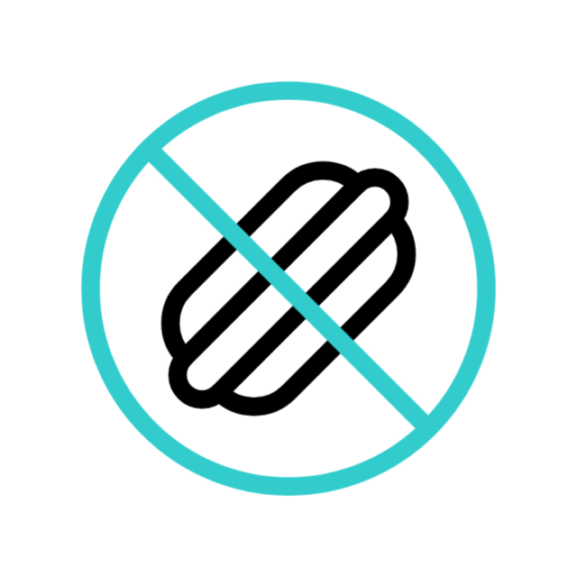
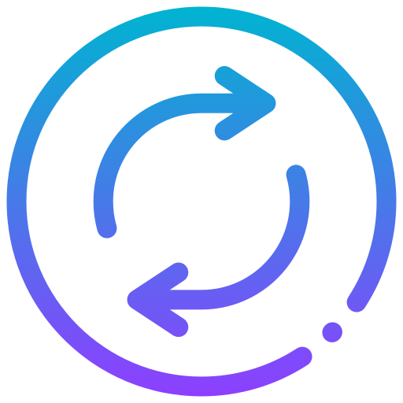

<p align="center">
    <a href="http://aashisjha.com.np" target="_blank">
        
    </a>
</p>


<p align="center">
  <a href="https://github.com/howabsurd/readme-typing-svg">
    
  </a>
</p>


  <a href="https://github.com/howabsurd">
    
  </a>


<p align="center"> 
 🆃🅴🅲🅷 🆂🆃🅰🅲🅺<br>
  </p>

         


<details>
  <summary>Skills</summary>
  
- Problem Solving
- Attention to details
- Learning
- Web Content Writing
</details>

<details>
  <summary>Hobbies</summary>
🍽️ 🛌 👨🏻‍💻 🔁 
</br> 
  🌏 Traveling
  📚 Learning
  🎮 Video Games
  🎧 Listening to Music
</details>


---
``` java
// Check if the code is functioning correctly
if (isCodeWorking) {
    // Continuously improve the code quality until it reaches perfection
    while (codeQuality < perfection) {
        codeQuality++; // Increment code quality
    }
}

while(alive) {
  eat();
  sleep();
  code();
}
// - Aashis Jha
```

<hr />
<div align="center">
  <i>❝ᴅᴏ ᴡʜᴀᴛ ʏᴏᴜʀ ʜᴇᴀʀᴛ ᴛᴇʟʟꜱ ʏᴏᴜ ᴛᴏ ᴅᴏ ʏᴏᴜ ᴀʀᴇ ɴᴏᴛ ʙᴏᴜɴᴅ ᴛᴏ ꜰᴏʟʟᴏᴡ ᴛʜᴇ ᴏʀᴅᴇʀꜱ!<br><b>ᴀɴᴅ ʏᴏᴜ ᴀɴᴅ ʙᴇᴄᴏᴍᴇ ꜱʟᴀᴠᴇ, ᴛʜᴀᴛ ᴛʜᴇʏ ᴡᴀɴᴛ ʏᴏᴜ ᴛᴏ ʙᴇ ✨🥷</b>.<br>ʟᴇᴀʀɴ, ᴡʜᴀᴛ ʏᴏᴜ ᴡᴀɴᴛ ᴛᴏ ʟᴇᴀʀɴ ᴅᴏ ᴡʜᴀᴛ ʏᴏᴜ ᴡᴀɴᴛ ᴛᴏ ᴅᴏ<br><b>ᴊᴜꜱᴛ ᴘʀᴏᴠᴇ ᴛʜᴇᴍ ᴡʀᴏɴɢ. 🥷🎭 ɴᴇᴠᴇʀ ꜰᴏʀɢᴇᴛ ᴛʜɪꜱ.✨</b>❞</i>
</div>

<!-- 
<p align="center">
<a href=#></a>
<a href=#></a>
<a href=#></a>
<a href=#></a>
</p>  -->

---

<!--
| Project | Description | Built with |
| ------- | ----------- | ---------- |
|[Karaage](https://www.karaage.com/)|Karaage provides detailed instructions on how to prepare karaage, including the ingredients needed, step-by-step instructions, and photos to help readers visualize the process.|Next, Rapid Api, Laravel, Mysql|
|[Adventure Academy](https://www.adventureacademy.com/)|Adventure Academy is an online educational platform designed for children between the ages of 8 and 13. Built with React, the website provides an interactive learning experience in a virtual world environment.|React, Node, Express, Firebase, Unity|
|[Supermetrics](https://supermetrics.com/)|Supermetrics is a data analytics tool that allows users to gather and analyze data from multiple sources, such as social media platforms, advertising networks, and website analytics tools, all in one place.|Saas, Crm solution|
|[Nefty Market](https://nefty-nft.vercel.app/#/)|World’s First Solana NFT Marketplace with Virtual Reality with Next. Explore, Buy, Sell and Create NFT’s on this Solana Marketplace. All NFTs on this site have been vetted for provenance and authenticity.|Nft, Solana|
|[Saas For business](https://github.com/Dmoon16/Saas-business)|Saas app for business|React, Material-UI, Next, MobX, WebSockets, Express, Node|
|[Ecommerce-Next](https://github.com/Dmoon16/ecommerce-next)|Beautiful and clean Ecommerce Platform with Next|Next, TailwindCss|
|[Caption Meow](https://github.com/Dmoon16/caption-meow)|An open-source social network that provides a daily creative challenge for cat lovers to come up with witty captions for cat photos while competing with other users.|React, Firebase|
|[Twitter Gallery](https://github.com/Dmoon16/gallery-twitter)|A Next.js application that allows you to easily browse and filter media files from Twitter users.|Next.js, Redis, TailwindCSS, Twitter API SDK|
|[Solana Nft Multi Staking](https://github.com/Dmoon16/nft-multi-staking-solana-react)|Barnyard NFT Staking, Land, Animal, Farmer, Solana, $Wheat token.|React, Web3, Rust|
|[My Voice](https://github.com/emrecoban/my-voice)|An Android app helps disabled people. The project's aim is to help disabled people to able to communicate more easily with people who do not know sign language.|Java, TextToSpeech|
</p>  -->
