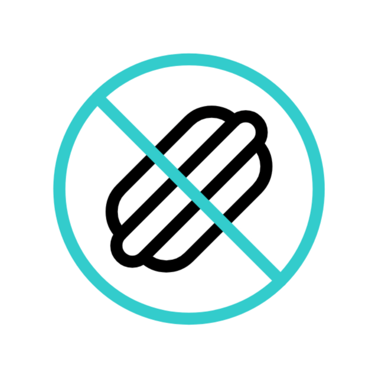
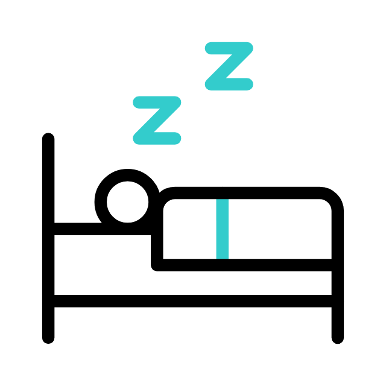
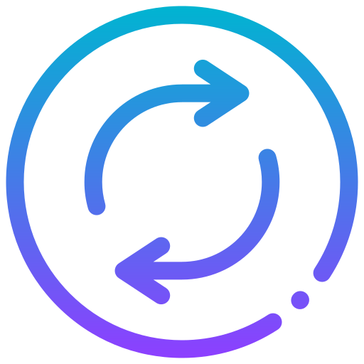

<p align="center">
        
</p>


<p align="center">
  <a href="https://github.com/howabsurd">
    
  </a>
</p>


<p align="center"> 
 🆃🅴🅲🅷 🆂🆃🅰🅲🅺<br>
  </p>
  
             	


<details>
  <summary>Skills</summary>
  
- Problem Solving
- Attention to details
- Learning
- Web Content Writing
</details>


<details>
  <summary>Hobbies</summary>
🍽️ 🛌 👨🏻‍💻 🔁 
</br> 
  🌏 Traveling
  📚 Learning
  🎮 Video Games
  🎧 Listening to Music
</details>


---
``` java
// Check if the code is functioning correctly
if (isCodeWorking) {
    // Continuously improve the code quality until it reaches perfection
    while (codeQuality < perfection) {
        codeQuality++; // Increment code quality
    }
}

while(alive) {
  eat();
  sleep();
  code();
}
// - Krish Poptani
```

<hr />
<div align="center">
  <i>❝ᴅᴏ ᴡʜᴀᴛ ʏᴏᴜʀ ʜᴇᴀʀᴛ ᴛᴇʟʟꜱ ʏᴏᴜ ᴛᴏ ᴅᴏ ʏᴏᴜ ᴀʀᴇ ɴᴏᴛ ʙᴏᴜɴᴅ ᴛᴏ ꜰᴏʟʟᴏᴡ ᴛʜᴇ ᴏʀᴅᴇʀꜱ!<br><b>ᴀɴᴅ ʏᴏᴜ ᴀɴᴅ ʙᴇᴄᴏᴍᴇ ꜱʟᴀᴠᴇ, ᴛʜᴀᴛ ᴛʜᴇʏ ᴡᴀɴᴛ ʏᴏᴜ ᴛᴏ ʙᴇ ✨🥷</b>.<br>ʟᴇᴀʀɴ, ᴡʜᴀᴛ ʏᴏᴜ ᴡᴀɴᴛ ᴛᴏ ʟᴇᴀʀɴ ᴅᴏ ᴡʜᴀᴛ ʏᴏᴜ ᴡᴀɴᴛ ᴛᴏ ᴅᴏ<br><b>ᴊᴜꜱᴛ ᴘʀᴏᴠᴇ ᴛʜᴇᴍ ᴡʀᴏɴɢ. 🥷🎭 ɴᴇᴠᴇʀ ꜰᴏʀɢᴇᴛ ᴛʜɪꜱ.✨</b>❞</i>
</div>


<p align="center">
<a href=#></a>
<a href=#></a>
<a href=#></a>
<a href=#></a>
</p>  
